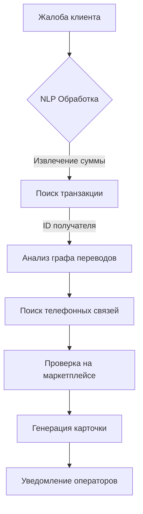

# 🏦 BEN: Banking Ecosystem Network

Система автоматизированного выявления и анализа фрод-инцидентов в банке.  
Включает REST API на FastAPI, движок расследований и Telegram-бот для операторов.

[](https://super-coders-itmo.github.io/BEN/)
[](https://github.com/SUPER-CODERS-itmo/BEN/actions/workflows/docs.yml)
[](https://www.python.org/downloads/release/python-3100/)

---

## 📁 Структура проекта

```
BEN/
├── backend/
│   ├── api.py                        # BEN API (FastAPI)
│   ├── fraud_analysis.py             # Логика расследования
│   ├── db_creator.py                 # Генератор тестовых данных
│   └── data/
│       ├── bot_users.db              # БД пользователей бота
│       ├── ecosystem_data.db         # Основная БД экосистемы
│       └── bank_complaints.tsv       # Жалобы клиентов
├── bot/
│   ├── main.py                       # Точка входа бота
│   ├── config.py                     # Настройки через env-переменные
│   ├── handlers/
│   │   ├── auth.py                   # /start, вход, выход
│   │   ├── cases.py                  # Жалобы, расследования, топ-10
│   │   └── admin.py                  # Управление пользователями
│   └── services/
│       ├── db.py                     # Работа с bot_users.db
│       ├── api_client.py             # Клиент BEN API
│       ├── poller.py                 # Фоновый поллер новых жалоб
│       └── formatter.py              # Форматирование сообщений
├── tests/                            # Модульные тесты (pytest)
└── frontend/                         # Веб-интерфейс
```

---

## 🧠 Алгоритм поиска мошенников

Система последовательно проходит 6 стадий обработки данных:

### 1. Обработка жалоб (NLP-анализ)
Входящие текстовые жалобы анализируются автоматически. Извлекаются суть инцидента и предполагаемая сумма ущерба.

### 2. Идентификация транзакции
По ID пострадавшего и извлечённой сумме находится точное списание в транзакционной БД. Счёт получателя помечается как **подозрительный**.

### 3. Анализ графа переводов
Строится локальный граф транзакций для подозрительного счёта:
- Анализ входящих и исходящих потоков.
- Выявление цепочек дробления и вывода средств (мулы, транзитные счета).
- Поиск потенциальных сообщников.

### 4. Кросс-канальный поиск (Phone Intelligence)
Банковские данные связываются с телекоммуникационными:
- Определяется владелец подозрительного счёта через профиль экосистемы.
- Анализируется история звонков между жертвой и подозреваемым.
- Особое внимание — звонкам непосредственно перед транзакцией.

### 5. Верификация через маркетплейс
Поиск цифровых следов мошенника в смежных сервисах:
- Проверка ФИО, телефона и адресов доставки.
- Выявление реальных физических адресов за фиктивными личностями.

### 6. Формирование отчётности
- Сводная карточка мошенника с тегами риска.
- Структурированный JSON для дальнейшего анализа.
- Уведомление операторам через Telegram.



---

## 🌐 BEN API — эндпоинты

| Метод | Путь | Описание |
|---|---|---|
| POST | `/login` | Авторизация по логину/паролю |
| GET | `/complaints` | Список жалоб с фильтрацией по дате |
| GET | `/complaints/{id}` | Текст конкретной жалобы |
| POST | `/investigate/{id}` | Запуск расследования по жалобе |
| GET | `/cases/{id}/calls` | Звонки между мошенником и жертвой |
| GET | `/cases/{id}/delivery` | Доставки маркетплейса мошенника |
| GET | `/frauds` | Список профилей выявленных мошенников |
| GET | `/full-profile/{id}` | Полный профиль пользователя |

Swagger-документация: `http://localhost:8000/docs`

---

## 🤖 Telegram-бот

Бот уведомляет операторов о новых кейсах и позволяет расследовать жалобы прямо в Telegram.

### Меню оператора

| Кнопка | Действие |
|---|---|
| 📋 Жалобы | Последние 10 жалоб + кнопки быстрого расследования |
| 🔍 Расследовать | Ввести ID жалобы вручную (или команда `/case B_5400`) |
| 🏴‍☠️ Топ мошенников | Последние 10 выявленных мошенников с профилями |
| 🚪 Выйти | Отвязать TG ID, отключить уведомления |

### Дополнительно для администратора

| Кнопка | Действие |
|---|---|
| 👥 Пользователи | Список всех сотрудников (🟢 привязан / 🔴 нет) |
| ➕ Добавить | Создать нового пользователя |
| 🗑 Удалить | Удалить пользователя по логину |
| 🔗 Задать TG ID | Привязать Telegram ID вручную |

### Автоуведомления

Каждые 60 секунд бот проверяет новые жалобы. При появлении новой — автоматически расследует и рассылает сводку всем операторам с привязанным Telegram ID. Сводка содержит ФИО жертвы и мошенника, сумму и дату транзакции, историю звонков и адреса доставок.

---

## ⚙️ Первый запуск

### Шаг 1 — Установка Python

Скачай и установи Python 3.12 с [python.org](https://www.python.org/downloads/release/python-3120/).

> ⚠️ Python 3.14 не поддерживается рядом библиотек. Рекомендуется 3.12.

```powershell
python --version
# Python 3.12.x
```

### Шаг 2 — Установка зависимостей

```powershell
pip install -r requirements.txt
```

### Шаг 3 — Генерация базы данных

```powershell
python backend/db_creator.py
```

Создаст `ecosystem_data.db` с 1500 клиентами и 150 кейсами, и `bank_complaints.tsv`.

### Шаг 4 — Получение токена бота

1. Открой Telegram, найди `@BotFather`
2. Напиши `/newbot`, придумай название и юзернейм (должен заканчиваться на `bot`)
3. Сохрани токен вида `7123456789:AAF...`

---

## 🚀 Запуск

Нужно два терминала.

**Терминал 1 — BEN API:**
```powershell
python -m uvicorn backend.api:app --port 8000
```

**Терминал 2 — Telegram бот:**
```powershell
# Без этого запросы к API идут через VPN и не работают
set NO_PROXY=localhost,127.0.0.1

set BOT_TOKEN=7123456789:AAF...
python bot/main.py
```

---

## ⚙️ Конфигурация

| Переменная | По умолчанию | Описание |
|---|---|---|
| `BOT_TOKEN` | — | Токен от @BotFather (обязательно) |
| `BEN_API_URL` | `http://127.0.0.1:8000` | URL BEN API |
| `BEN_API_TOKEN` | `secret-token-123` | Bearer-токен для API |
| `USERS_DB` | `data/bot_users.db` | Путь к БД пользователей бота |
| `POLL_INTERVAL` | `60` | Интервал проверки новых жалоб (сек) |

---

## ❗ Частые проблемы

**503 при обращении к API**  
Выполни `set NO_PROXY=localhost,127.0.0.1` в терминале с ботом и убедись что API запущен.

**ModuleNotFoundError**
```powershell
pip install -r requirements.txt
```

**Cannot connect to api.telegram.org**  
Включи VPN или добавь прокси в `bot/main.py`:
```python
session = AiohttpSession(proxy="socks5://127.0.0.1:10808")
```

**404 при расследовании**  
Данные рассинхронизированы — пересоздай базу:
```powershell
python backend/db_creator.py
```

**Бот завис в состоянии расследования**  
Напиши `/start` в боте — сбросит FSM-состояние.
